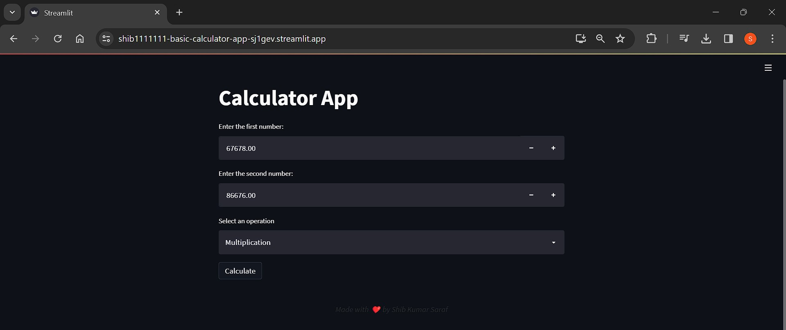

# Basic Calculator Web Application

This repository contains a concise yet comprehensive calculator web application developed using the Streamlit framework in Python. The application allows users to input two numbers and choose from a selection of arithmetic operations, including addition, subtraction, multiplication, or division. The application then executes the selected operation and displays the resulting output.

## Project Structure

The project is well-organized and includes the following files:

- **app.py**: This serves as the main file that defines the Streamlit web application and manages user input and output.
- **calculator_logic.py**: This module contains the fundamental logic of the calculator, including the calculation functions.
- **requirements.txt**: This file lists the required Python dependencies for running the application.

## Screenshots
<table align="center">
  <tr>
    <td></td>
  </tr>
  <tr>
    <td><em>Home Page with outputs </em></td>
  </tr>
</table>


## Getting Started

Before you can run this app, ensure that you have the necessary prerequisites installed on your machine.

### Prerequisites

Make sure you have the following installed:

- [Python 3.x](https://www.python.org/downloads/): The programming language used to run the app.

### Installation

Follow these steps to set up this app on your local machine: 

1. **Clone the Repository:**

   Open your terminal and run the following commands:

   ```bash
   git clone https://github.com/shib1111111/basic_calculator.git
   cd basic_calculator

   ```

2. **Install Dependencies:**

Run the following command to install the required dependencies:

```bash
pip install -r requirements.txt
  ```

## Usage
To run this app, execute the following command in your terminal:
```bash
streamlit run calculator_logic.py
```
Visit the provided local URL (usually http://localhost:8501) in your web browser to access the app. <br>

or directly go to deployed server url : https://shib1111111-basic-calculator-app-sj1gev.streamlit.app/

## Contributing

We welcome contributions to enhance this repo. Feel free to open issues or submit pull requests.

## License

This project is licensed under the [MIT License](LICENSE).

Thank you for using this repo! Feel free to reach out with any questions or feedback.

<em style="color: #ff66b2; font-weight: bold;">✨ --- Designed & made with Love by Shib Kumar Saraf ✨</em>
